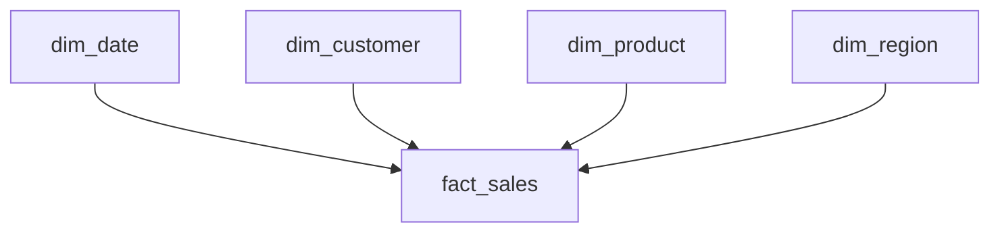

# Case Study 03 — Warehouse Design

## Účel případové studie

Účelem případové studie je navrhnout jednoduché analytické řešení pro obchodní reporting a prakticky rozlišit role data warehouse, data lake a lakehouse.

Cílem není vytvořit skutečný datový sklad ani implementovat kompletní datovou pipeline. Výstupem bude architektonický a datový návrh odpovídající potřebám datového analytika.

## Business kontext

Obchodní společnost získává prodejní data z několika zdrojových systémů.

K dispozici jsou:
- objednávky exportované z e-shopu do CSV;
- zákaznická data poskytovaná z CRM ve formátu JSON;
- produktová data uložená v relační databázi.

Management potřebuje tato data pravidelně analyzovat v Power BI. Jednotlivé zdroje však používají odlišné formáty a nejsou připravené jako jednotný analytický model.

## Výchozí situace

Zdrojová data jsou uložena odděleně:

```text
e-shop
→ orders.csv

CRM
→ customers.json

produktový systém
→ databázová tabulka products
```

Původní data je potřeba zachovat pro případnou kontrolu nebo nové zpracování. Pro reporting zároveň potřebujeme připravit strukturovaná a vzájemně propojená data.

V současnosti není stanoveno:
- která data mají být zachována v původní podobě;
- která data mají být připravena pro analytické úložiště;
- co bude představovat jeden řádek faktové tabulky;
- které údaje patří do faktové tabulky a které do dimenzí;
- jak mají být tabulky propojeny;
- jaký model má být předán do Power BI.

## Požadavky na reporting

Management potřebuje v Power BI sledovat:
- celkové tržby;
- celkové náklady;
- celkový zisk;
- prodané množství;
- vývoj výsledků v čase;
- výsledky podle zákazníků;
- výsledky podle produktů a kategorií;
- výsledky podle regionů.

Analytické řešení má být navrženo tak, aby:
- zachovalo původní zdrojová data;
- poskytovalo jednotná a připravená data pro reporting;
- umožňovalo filtrování podle času, zákazníka, produktu a regionu;
- používalo přehledné vztahy typu 1:N;
- bylo vhodné jako zdroj pro Power BI.

## Úkol 1 — rozdělení dat mezi úložiště

Navrhni základní datovou cestu od zdrojových systémů až k reportingu v Power BI.

Při návrhu urči:
1. kam uložit původní zdrojová data;
2. kam uložit připravené faktové a dimenzní tabulky;
3. ke kterému úložišti připojit Power BI;
4. jakou roli v navrženém řešení plní data lake;
5. jakou roli v navrženém řešení plní data warehouse.

Zvaž také, zda je pro tento scénář vhodnější:
- kombinace data lake a data warehouse;
- nebo jednotné lakehouse prostředí.

Svou volbu stručně zdůvodni.

## Úkol 1 — řešení

Pro případovou studii byla zvolena kombinace data lake a data warehouse.

Navržená datová cesta:

```text
e-shop → orders.csv
CRM → customers.json
produktový systém → databázová tabulka products
                    ↓
                 data lake
          původní zdrojová data
                    ↓
          čištění a transformace
                    ↓
              data warehouse
               Sales datamart
                    ↓
                 Power BI
```

## Úkol 2 — granularita faktové tabulky

Před návrhem sloupců musíme určit, co představuje jeden řádek `fact_sales`.

Předpokládejme, že:
- jedna objednávka může obsahovat více produktů;
- stejný produkt se může objevit v mnoha objednávkách;
- množství, cena, sleva a náklady mohou být odlišné pro každou položku.

Možné úrovně granularity:

```text
1 řádek = 1 objednávka

## Úkol 2 — granularita faktové tabulky

Urči, co bude představovat jeden řádek tabulky `fact_sales`.

Předpokládej, že:

- jedna objednávka může obsahovat více produktů;
- stejný produkt se může objevit v mnoha objednávkách;
- množství, cena, sleva a náklady mohou být odlišné pro každou položku.

Zvaž dvě možné úrovně granularity:

```text
1 řádek = 1 objednávka
```

nebo:

```text
1 řádek = 1 položka objednávky
```

Následně navrhni základní obsah faktové tabulky a způsob identifikace jejích řádků.

## Úkol 2 — řešení

Zvolená granularita:

```text
1 řádek
=
1 položka jedné objednávky
```

Tato granularita umožňuje analyzovat tržby, náklady, zisk a prodané množství podle jednotlivých produktů.

Pokud tedy např. jedna objednávka obsahuje čtyři produktové položky, budou ve `fact_sales` čtyři řádky.

### Identifikace řádků

Každý řádek bude identifikován technickým klíčem:

```text
sales_key
```

Ve faktové tabulce současně zůstanou:

- `order_id` pro identifikaci celé objednávky;
- `line_number` pro určení položky uvnitř objednávky.

`order_id` se může opakovat, protože jedna objednávka může obsahovat více položek.

Počet objednávek proto nelze určit prostým počtem řádků. Musí se počítat jako počet jedinečných hodnot (DISTINCT) `order_id`.

### Navržená struktura `fact_sales`

#### Technický klíč

* `sales_key` – jednoznačný technický identifikátor řádku faktové tabulky.

#### Identifikace objednávky a položky

* `order_id` – identifikátor celé objednávky; ve faktové tabulce funguje jako degenerate dimension;
* `line_number` – pořadí konkrétní položky uvnitř objednávky.

#### Cizí klíče do dimenzí

* `date_key` – odkaz do `dim_date`;
* `customer_key` – odkaz do `dim_customer`;
* `product_key` – odkaz do `dim_product`;
* `region_key` – odkaz do `dim_region`.

#### Hodnoty konkrétní transakce

* `quantity` – prodané množství;
* `unit_price` – skutečná jednotková cena při prodeji;
* `unit_cost` – jednotkový náklad platný při prodeji;
* `discount_pct` – sleva použitá u konkrétní položky;
* `revenue` – tržba za položku;
* `cost` – celkové náklady na položku.


### Základní výpočty

```text
revenue = quantity × unit_price × (1 − discount_pct)

cost = quantity × unit_cost

profit = revenue − cost
```

Skutečná prodejní cena, sleva a jednotkové náklady patří do faktové tabulky, protože se vztahují ke konkrétní transakci a mohou se v čase měnit.

`profit` nemusí být fyzicky uložen jako samostatný sloupec. Může být vypočítán jako míra v analytickém nebo sémantickém modelu.

## Úkol 3 — návrh dimenzních tabulek

Navrhni dimenzní tabulky pro analýzu prodejů podle:
- zákazníků;
- produktů;
- kalendářních období;
- regionů doručení.

U každé dimenze urči:
- technický primární klíč;
- původní identifikátor ze zdrojového systému;
- základní popisné atributy;
- analytické využití;
- vztah k `fact_sales`.

Zohledni také situaci, kdy objednávka odkazuje na zákazníka, který nebyl nalezen ve zdrojových zákaznických datech.

## Úkol 3 — řešení

### `dim_customer`

Navržené sloupce:
- `customer_key` – technický primární klíč datového skladu;
- `customer_id` – původní identifikátor zákazníka z CRM;
- `customer_name` – jméno nebo název zákazníka;
- `customer_type` – typ zákazníka, například B2B nebo B2C.

Pro zákazníka, kterého nelze dohledat ve zdrojových datech, bude vytvořen technický záznam:

```text
customer_key = 0
customer_name = Unknown
customer_type = Unknown
```

Objednávka zůstane zachována a ve `fact_sales` získá `customer_key = 0`.

### `dim_product`

Navržené sloupce:
- `product_key` – technický primární klíč datového skladu;
- `product_id` – původní identifikátor produktu;
- `product_name` – název produktu;
- `category` – produktová kategorie;
- `brand` – značka produktu.

Skutečná jednotková cena a jednotkové náklady použité při prodeji zůstanou ve `fact_sales`, protože se vztahují ke konkrétní transakci.

### `dim_date`

Navržené sloupce:
- `date_key` – technický primární klíč, například ve formátu `YYYYMMDD`;
- `date` – celé kalendářní datum;
- `day` – den v měsíci;
- `day_name` – název dne;
- `month_number` – číslo měsíce pro správné řazení;
- `month_name` – název měsíce pro zobrazení;
- `quarter` – kalendářní čtvrtletí;
- `year` – kalendářní rok.

Dimenze umožní jednotné filtrování, seskupování a porovnávání výsledků v čase.

### `dim_region`

Pro tuto případovou studii je region definován jako:

```text
region doručení v okamžiku prodeje
```

Navržené sloupce:
- `region_key` – technický primární klíč datového skladu;
- `region_code` – původní nebo standardizovaný kód regionu;
- `region_name` – název regionu;
- `country` – země.

Region je připojen přímo k `fact_sales`. Historický prodej tak zůstane přiřazen k regionu skutečného doručení, i když zákazník později změní adresu.

### Přirozené a technické klíče

Zdrojové identifikátory, například `customer_id` a `product_id`, jsou natural neboli business keys.

Datový sklad pro vztahy používá vlastní surrogate keys:
- `customer_key`;
- `product_key`;
- `date_key`;
- `region_key`.

Tyto technické klíče jsou primárními klíči dimenzí a současně cizími klíči ve `fact_sales`.

## Úkol 4 — vztahy a hvězdicové schéma

Navrhni vztahy mezi `fact_sales` a připravenými dimenzními tabulkami.

Urči:
- kardinalitu jednotlivých vztahů;
- požadavek na jedinečnost klíčů;
- směr filtrování v Power BI;
- zda je nutné přímo propojovat jednotlivé dimenze.

## Úkol 4 — řešení

Všechny dimenzní tabulky budou propojeny přímo s `fact_sales` pomocí vztahu 1:N.

```text
dim_customer 1:N fact_sales
dim_product  1:N fact_sales
dim_date     1:N fact_sales
dim_region   1:N fact_sales
```

Na straně dimenze musí být technický klíč jedinečný. Ve faktové tabulce se stejný cizí klíč může opakovat v mnoha řádcích.

### Schéma modelu



Použité vazby:
- `dim_customer[customer_key]` → `fact_sales[customer_key]`;
- `dim_product[product_key]` → `fact_sales[product_key]`;
- `dim_date[date_key]` → `fact_sales[date_key]`;
- `dim_region[region_key]` → `fact_sales[region_key]`.

V Power BI budou vztahy nastaveny jako:
- kardinalita `One to many (1:*)`;
- směr filtrování `Single`;
- filtrování z dimenzí do faktové tabulky;
- aktivní vztahy.

Jednotlivé dimenze nebudou v jednoduchém hvězdicovém schématu propojeny přímo mezi sebou. Každá dimenze filtruje `fact_sales`, nad kterou se počítají požadované ukazatele.

## Úkol 5 — mapování zdrojových dat

Urči, ze kterých zdrojů vzniknou jednotlivé tabulky Sales datamartu.

Pro každou cílovou tabulku stanov:
- hlavní zdroj dat;
- zdrojové business klíče;
- technické klíče vytvořené v datovém skladu;
- základní transformační kroky;
- postup při nenalezení odpovídajícího záznamu v dimenzi.

## Úkol 5 — řešení

### `customers.json` → `dim_customer`

Ze zákaznického zdroje budou převzaty:
- `customer_id`;
- `customer_name`;
- `customer_type`.

Datový sklad vytvoří technický klíč:

```text
customer_key
```

Pokud objednávka odkazuje na zákazníka, který nebyl nalezen, použije se technický záznam `Unknown` s hodnotou `customer_key = 0`.

### Databázová tabulka `products` → `dim_product`

Z produktového systému budou převzaty:
- `product_id`;
- `product_name`;
- `category`;
- `brand`.

Datový sklad vytvoří technický klíč:

```text
product_key
```

### Kalendář → `dim_date`

`dim_date` bude vytvořena jako souvislá kalendářní tabulka pokrývající celé požadované období.

Bude obsahovat například:
- `date_key`;
- `date`;
- `day`;
- `day_name`;
- `month_number`;
- `month_name`;
- `quarter`;
- `year`.

Datum objednávky se při zpracování převede na odpovídající `date_key`.

### Regiony doručení → `dim_region`

Jedinečné regiony doručení budou standardizovány a uloženy do `dim_region`.

Datový sklad vytvoří:
- `region_key`;
- `region_code`;
- `region_name`;
- `country`.

Region u každé prodejní položky bude nahrazen odpovídajícím `region_key`.

### `orders.csv` → `fact_sales`

Objednávky a jejich položky vytvoří základ faktové tabulky.

Ze zdroje budou použity například:
- `order_id`;
- `line_number`;
- `order_date`;
- `customer_id`;
- `product_id`;
- region doručení;
- `quantity`;
- `unit_price`;
- `unit_cost`;
- `discount_pct`.

Při transformaci se:
1. vytvoří `sales_key`;
2. datum objednávky převede na `date_key`;
3. `customer_id` nahradí odpovídajícím `customer_key`;
4. `product_id` nahradí odpovídajícím `product_key`;
5. region doručení nahradí odpovídajícím `region_key`;
6. vypočítají řádkové hodnoty `revenue` a `cost`.

Výsledná datová cesta:

```text
customers.json → dim_customer ─┐
products       → dim_product  ─┤
kalendář       → dim_date     ─┼→ fact_sales
regiony        → dim_region   ─┤
orders.csv                    ─┘
```

Zdrojové business klíče zůstanou uložené v dimenzích pro dohledatelnost. Faktová tabulka bude pro vztahy používat technické klíče datového skladu.

## Úkol 6 — rozdělení výpočtů

Urči, které výpočty mají být připraveny na úrovni jednotlivých řádků v data warehouse a které mají být vytvořeny jako DAX míry v Power BI.

Zohledni:
- jednotnou definici business ukazatelů;
- granularitu položky objednávky;
- filtrování podle dimenzí;
- rozdíl mezi počtem položek a počtem objednávek.

## Úkol 6 — řešení

### Řádkové výpočty v data warehouse

Při přípravě `fact_sales` budou vypočítány hodnoty vztahující se ke konkrétní položce objednávky:

```text
revenue
= quantity × unit_price × (1 − discount_pct)

cost
= quantity × unit_cost
```

Centrální výpočet zajistí, že všechny navazující reporty používají stejnou definici tržeb a nákladů.

### DAX míry v Power BI

Power BI vytvoří agregované míry, které se budou přepočítávat podle aktuálních filtrů reportu.

```DAX
Total Revenue =
SUM(fact_sales[revenue])
```

```DAX
Total Cost =
SUM(fact_sales[cost])
```

```DAX
Total Profit =
[Total Revenue] - [Total Cost]
```

```DAX
Total Quantity =
SUM(fact_sales[quantity])
```

Protože jeden řádek představuje položku objednávky, počet objednávek musí být vypočítán z jedinečných hodnot `order_id`:

```DAX
Order Count =
DISTINCTCOUNT(fact_sales[order_id])
```

Počet řádků `fact_sales` by představoval počet prodaných položek, nikoliv počet objednávek.

### Průměrná hodnota objednávky

```DAX
Average Order Value =
DIVIDE(
    [Total Revenue],
    [Order Count]
)
```

### Zisková marže

```DAX
Profit Margin % =
DIVIDE(
    [Total Profit],
    [Total Revenue]
)
```

DAX míry respektují filtry z `dim_customer`, `dim_product`, `dim_date` a `dim_region`. Výsledky se proto automaticky přepočítají podle výběru uživatele.

## Úkol 7 — validace datového modelu

Navrhni kontroly, které mají být provedeny před předáním Sales datamartu do Power BI.

Zaměř se na:
- jedinečnost klíčů;
- referenční integritu;
- granularitu faktové tabulky;
- validitu číselných hodnot;
- správnost řádkových výpočtů;
- odsouhlasení výsledků proti zdrojovým datům.

## Úkol 7 — řešení

### Jedinečnost primárních klíčů

V každé dimenzi musí být technický primární klíč jedinečný:
- `dim_customer.customer_key`;
- `dim_product.product_key`;
- `dim_date.date_key`;
- `dim_region.region_key`.

Duplicita na straně dimenze by znemožnila vytvoření spolehlivého vztahu 1:N.

### Referenční integrita

Každý cizí klíč ve `fact_sales` musí odkazovat na existující záznam v příslušné dimenzi.

Kontrolují se:
- `customer_key`;
- `product_key`;
- `date_key`;
- `region_key`.

Pokud odpovídající člen dimenze nebyl nalezen, použije se předem připravený technický záznam `Unknown`.

### Kontrola granularity

Každý řádek `fact_sales` musí představovat jednu položku objednávky.

Kombinace:

```text
order_id + line_number
```

proto nesmí být duplicitní.

### Validita hodnot

Budou ověřena například následující pravidla:

```text
quantity > 0
unit_price >= 0
unit_cost >= 0
0 <= discount_pct <= 1
```

Vratky, storna nebo opravné transakce musí mít samostatně definovaná business pravidla.

### Kontrola řádkových výpočtů

Pro každý řádek bude ověřeno:

```text
revenue
= quantity × unit_price × (1 − discount_pct)

cost
= quantity × unit_cost
```

### Odsouhlasení proti zdroji

Výsledky po transformaci budou porovnány se zdrojovými daty.

Kontrolovány budou zejména:
- počet objednávek;
- počet položek;
- celkové množství;
- celkové tržby;
- celkové náklady.

Pokud se počet nebo hodnota změní, musí být rozdíl vysvětlen konkrétním transformačním nebo validačním pravidlem.

Například rozdíl v počtu řádků může vzniknout při:
- chybném použití `INNER JOIN`;
- odstranění nedohledaných zákazníků;
- nesprávném odstranění duplicit;
- filtrování neplatných hodnot;
- chybné konverzi datových typů.

Nevysvětlené rozdíly nesmí být před předáním dat do reportingu ignorovány.

## Úkol 8 — závěrečný návrh architektury

Sestav výsledný návrh datové architektury a vysvětli roli jednotlivých částí.

Návrh musí:
- zachovat původní zdrojová data;
- umožnit opakované zpracování;
- poskytovat připravené faktové a dimenzní tabulky;
- podporovat jednotná business pravidla;
- sloužit jako zdroj pro Power BI.

## Úkol 8 — řešení

Pro případovou studii byla zvolena kombinace data lake a data warehouse.

### Výsledná architektura

```text
e-shop
→ orders.csv
                ┐
CRM             │
→ customers.json├→ data lake
                │  původní data
produktový systém
→ products      ┘
                    ↓
          čištění a transformace
                    ↓
              data warehouse
                    ↓
              Sales datamart
        ┌───────────┼───────────┐
        ↓           ↓           ↓
   fact_sales   dimenze    business pravidla
        └───────────┼───────────┘
                    ↓
                 Power BI
                    ↓
       sémantický model a reporting
```

### Role data lake

Data lake uchovává původní zdrojová data:
- CSV exporty objednávek;
- JSON data zákazníků;
- databázové exporty produktů.

Původní data zůstávají dostupná pro kontrolu, opakované zpracování a případnou změnu transformačních pravidel.

### Role data warehouse

Data warehouse obsahuje vyčištěná, validovaná a strukturovaná data připravená pro analytiku.

Sales datamart tvoří:
- `fact_sales`;
- `dim_customer`;
- `dim_product`;
- `dim_date`;
- `dim_region`.

Datový sklad zajišťuje:
- jednotnou granularitu;
- technické klíče;
- referenční integritu;
- jednotné řádkové výpočty;
- historická data;
- opakované využití modelu více reporty.

### Role Power BI

Power BI načte připravené faktové a dimenzní tabulky.

Jeho úlohou je:
- vytvořit sémantický model;
- nastavit vztahy 1:N;
- vytvořit DAX míry;
- umožnit filtrování podle dimenzí;
- prezentovat výsledky uživatelům.

### Lakehouse jako alternativní řešení

Stejný proces by bylo možné vytvořit také v lakehouse architektuře, ve které jsou původní i připravená data uložena v jednom prostředí v různých úrovních zpracování.

Pro tuto případovou studii byla zvolena kombinace data lake a data warehouse, aby byly jasně odděleny jejich role.

Návrh lakehouse vrstev bude řešen v navazující Case Study 04 — Lakehouse Layers.

## Závěr

Navržené řešení odděluje uchování původních dat, přípravu analytického modelu a tvorbu reportu.

```text
data lake
→ uchování původních dat

data warehouse
→ důvěryhodná analytická data

Power BI
→ výpočty, filtrování a prezentace
```

Hvězdicové schéma poskytuje přehledný a opakovaně použitelný základ pro analýzu tržeb, nákladů, zisku, zákazníků, produktů, času a regionů.

Použití Sparku ani Databricks není automatickou součástí návrhu. Jejich potřeba by závisela na skutečném objemu dat, náročnosti zpracování a dostupné infrastruktuře.