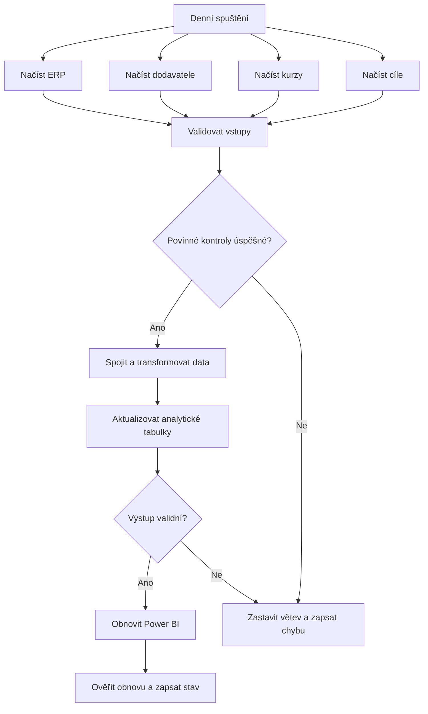

# Case Study 06 — Inventory Reporting Orchestration

## Účel případové studie

Cílem případové studie je navrhnout přehledný a řízený datový proces pro každodenní aktualizaci skladového reportingu.

Případová studie má ukázat schopnost:
- rozdělit datový proces na samostatné úlohy;
- určit vstupy a výstupy jednotlivých úloh;
- navrhnout správné pořadí kroků;
- rozpoznat závislé a nezávislé úlohy;
- určit, které kroky mohou probíhat paralelně;
- navrhnout základní kontroly datové kvality;
- rozlišit povinné a volitelné datové vstupy;
- rozhodnout, co se má stát při chybě;
- zabránit publikaci neúplných nebo chybných výsledků.

Nejde o implementaci konkrétního orchestračního nástroje. Výstupem bude koncepční návrh procesu, jeho závislostí a chování při úspěchu nebo selhání.

## Business kontext

Maloobchodní společnost provozuje několik skladů a potřebuje každý den aktualizovat Power BI report o stavu a hodnotě zásob.

Data pocházejí z několika systémů a nejsou dostupná ve stejném formátu ani ve stejný okamžik. Současná příprava reportu obsahuje ruční kroky, kvůli kterým může dojít k opožděné aktualizaci, použití neaktuálních dat nebo publikaci neúplného výsledku.

Společnost proto potřebuje navrhnout řízený proces, který:
- načte všechny potřebné vstupy;
- ověří jejich dostupnost a základní kvalitu;
- provede transformace ve správném pořadí;
- vytvoří analytické tabulky;
- obnoví Power BI report pouze po úspěšném dokončení povinných kroků;
- zaznamená případné selhání pro následnou kontrolu.

## Datové zdroje

Společnost pracuje s následujícími zdroji:

### ERP databáze

Obsahuje:
- seznam produktů;
- aktuální množství zásob;
- nákupní ceny a měny;
- sklad, ve kterém je zboží uloženo;
- produktové kategorie.

### CSV soubor od dodavatelů

Obsahuje:
- identifikátor produktu;
- množství dostupné u dodavatele;
- očekávanou dodací lhůtu.

### Kurzovní API

Poskytuje aktuální směnné kurzy potřebné pro převod nákupních cen do CZK.

### Excel soubor s cílovými hodnotami

Obsahuje:
- minimální skladové množství;
- maximální skladové množství;
- cílovou hodnotu zásob podle skladu nebo kategorie.

## Business požadavky

Management potřebuje sledovat:
- aktuální množství zásob;
- hodnotu zásob v CZK;
- produkty pod minimálním skladovým množstvím;
- produkty nad maximálním skladovým množstvím;
- dostupnost produktů u dodavatelů;
- stav zásob podle skladu;
- stav zásob podle produktové kategorie;
- porovnání skutečné a cílové hodnoty zásob;
- vývoj skladových ukazatelů v čase.

Výsledná data mají být aktualizována každý den a zpřístupněna prostřednictvím Power BI.

## Technické požadavky

Navržený proces musí umožnit:
- načtení dat ze všech zdrojů;
- paralelní spuštění vzájemně nezávislých vstupních úloh;
- kontrolu, zda bylo načtení technicky úspěšné;
- validaci povinných sloupců a datových typů;
- kontrolu duplicit, chybějících hodnot a neplatných vazeb;
- spojení skladových dat s produkty, kurzy, dodavateli a cíli;
- převod nákupních cen do CZK;
- výpočet business ukazatelů;
- vytvoření nebo aktualizaci analytických tabulek;
- závěrečnou kontrolu výsledku;
- obnovení Power BI reportu až po úspěšné validaci;
- ukončení nebo omezení procesu při chybě povinného vstupu;
- zaznamenání stavu jednotlivých úloh.

## Očekávaný výstup

Výstupem případové studie bude:
- seznam navržených úloh;
- určení vstupu a výstupu každé úlohy;
- návrh pořadí a závislostí mezi úlohami;
- označení kroků, které mohou běžet paralelně;
- rozdělení vstupů a kontrol na povinné a volitelné;
- návrh validačních bodů;
- návrh úspěšné a chybové větve procesu;
- stanovení podmínek, za kterých lze obnovit Power BI report;
- jednoduchý diagram navržené pipeline.

## Rozsah případové studie

Případová studie je zaměřena na orchestrace jako princip a na logiku řízení datového procesu.

Nezahrnuje:
- implementaci pipeline v konkrétním nástroji;
- nastavení přesného časového plánu;
- konfiguraci automatických opakování neúspěšných úloh;
- vytvoření technických alertů;
- detailní návrh produkčního monitoringu;
- implementaci SQL nebo Python transformací;
- nasazení cloudových prostředků;
- vytvoření výsledného Power BI reportu.

Názvy zdrojů, tabulek, atributů a úloh slouží pro koncepční návrh. Při skutečné implementaci by se upravily podle dostupných dat, použitých technologií a firemních pravidel.

---

## Úkol 1 — Zahájení procesu

Datové zdroje na sobě při načítání nejsou závislé. Jak je nejvhodnější je načíst?

### Úkol 1 — řešení

Načítání ERP databáze, dodavatelského CSV, kurzovního API a excelu na sobě vzájemně nezávisí, a proto může probíhat paralelně. Tím lze zkrátit celkovou dobu procesu.

```text
paralelní načtení zdrojů
→ kontrola dostupnosti a kvality
→ rozhodnutí, zda lze pokračovat
```

## Úkol 2 — Závislost úloh

Výpočet hodnoty zásob v CZK potřebuje množství zásob, nákupní cenu, měnu a směnný kurz. Kdy se může tato úloha spustit?

### Úkol 2 — řešení

Výpočet závisí na dvou validovaných vstupech:
- ERP data poskytují množství zásob, nákupní cenu a měnu;
- kurzovní API poskytuje směnný kurz do CZK.

Úloha se může spustit až po úspěšném dokončení obou předchozích větví.

## Úkol 3 — Chyba povinného vstupu

Kurzovní API není dostupné a ERP obsahuje také ceny v cizích měnách. Jak má proces reagovat?

### Úkol 3 — řešení

Bez směnných kurzů nelze spolehlivě převést cizoměnové ceny do CZK. Proces proto musí:
- zastavit větev závislou na kurzovních datech;
- označit příslušnou úlohu jako neúspěšnou;
- zaznamenat chybu;
- neaktualizovat navazující finanční ukazatele a report.

Poslední úspěšná verze reportu může zůstat dostupná, ale s poznámkou, že není aktuální, pří. s datem poslední aktualizace.

## Úkol 4 — Povinný a volitelný vstup

CSV soubor od dodavatelů není dostupný. ERP data, kurzy i cílové hodnoty byly načteny správně. Jaký postup je nejvhodnější?

### Úkol 4 — řešení

Reakce procesu závisí na předem stanoveném business pravidle:
- pokud je dodavatelská dostupnost povinná, závislá část procesu se zastaví;
- pokud je volitelná, hlavní skladové ukazatele mohou být aktualizovány, ale dodavatelská část se vynechá nebo viditelně označí jako neaktuální.

Chybějící hodnotu nelze automaticky nahradit nulou. Nula by znamenala, že dodavatel nemá žádné zásoby.

---

## Úkol 5 — Kontrolní bod po načtení

ERP data byla technicky načtena bez chyby. Tabulka ale neobsahuje sloupec `purchase_price`, který je potřebný pro výpočet hodnoty zásob. Jak má dopadnout validace?

### Úkol 5 — řešení

Validace musí skončit neúspěšně, protože chybí povinný sloupec potřebný pro další výpočet.

```text
technická kontrola
→ podařilo se připojení a načtení?

datová kontrola
→ mají data správnou strukturu, typy a hodnoty?
```

## Úkol 6 — Pořadí validace a transformace

Kdy je vhodné spojit ERP data s kurzovními daty a vypočítat hodnotu zásob v CZK?

### Úkol 6 — řešení

Nejprve ověříme, že ERP data i kurzovní data mají očekávanou strukturu a použitelné hodnoty. Teprve potom je spojíme a provedeme výpočet.

```text
načtení ERP a kurzů
→ validace obou zdrojů
→ spojení dat
→ přepočet hodnoty zásob do CZK
→ analytická tabulka
```

## Úkol 7 — Závěrečná kontrola

Analytická tabulka byla úspěšně vytvořena. Co se má stát bezprostředně před obnovením Power BI reportu?

### Úkol 7 — řešení

Před obnovením Power BI je nutné zkontrolovat například:
- zda analytická tabulka obsahuje data;
- zda se nevyskytují neočekávané duplicity;
- zda nechybějí povinné klíče a hodnoty;
- zda jsou množství a finanční ukazatele v očekávaném rozsahu;
- zda byla data vytvořena pro správné období.

Až po úspěšné kontrole lze výsledek označit jako připravený k publikaci.

## Úkol 8 — Neúspěšná validace

Závěrečná validace analytické tabulky skončila neúspěšně. Co má udělat orchestrační proces?

### Úkol 8 — řešení

Power BI se nesmí obnovit nad nevalidovanými daty. Proces má:
- zablokovat obnovu reportu;
- zaznamenat neúspěšnou kontrolu;
- označit pipeline jako neúspěšnou;
- zachovat poslední správnou verzi výsledku;
- umožnit dohledat příčinu chyby v logu.

## Úkol 9 — Závislost Power BI reportu

Které úlohy musí být úspěšně dokončeny před obnovením Power BI reportu?

### Úkol 9 — řešení

Obnovení Power BI je závislé na dokončení celého povinného datového toku:

```text
načtení povinných zdrojů
→ validace
→ transformace
→ vytvoření analytických tabulek
→ závěrečná kontrola
→ obnovení Power BI
```

Samotné úspěšné načtení ERP nestačí.

## Úkol 10 — Ukončení pipeline

Power BI report byl úspěšně obnoven. Jaký krok by měl proces provést jako poslední?

### Úkol 10 — řešení

Samotné odeslání požadavku na obnovení Power BI ještě nemusí dokazovat, že byl report skutečně aktualizován. Poslední úloha proto:
- ověří stav obnovy;
- zaznamená čas dokončení;
- uloží výsledný stav pipeline;
- označí proces jako úspěšný.

## Výsledný návrh procesu

### Navržené úlohy

#### Fáze 1 — Paralelní načtení zdrojů

Po zahájení procesu mohou současně běžet čtyři nezávislé úlohy:
- **Načtení ERP**
  - vstup: ERP databáze;
  - výstup: skladová a produktová data.

- **Načtení dodavatelů**
  - vstup: CSV soubor;
  - výstup: dostupnost produktů a dodací lhůty.

- **Načtení kurzů**
  - vstup: kurzovní API;
  - výstup: směnné kurzy do CZK.

- **Načtení cílů**
  - vstup: Excel soubor;
  - výstup: skladové limity a cílové hodnoty.

#### Fáze 2 — Validace vstupů

Každý načtený zdroj projde technickou a datovou kontrolou.
- vstup: načtená zdrojová data;
- výstup: validované vstupy a výsledky kontrol;
- závislost: dokončení odpovídajících načítacích úloh.

#### Fáze 3 — Transformace dat

Validovaná data se spojí a použijí pro výpočet skladových ukazatelů.
- vstup: potřebné validované zdroje;
- výstup: spojená data a hodnoty zásob přepočtené do CZK;
- závislost: úspěšná validace povinných vstupů.

#### Fáze 4 — Aktualizace analytických tabulek

Transformovaná data se uloží do tabulek připravených pro reporting.
- vstup: transformovaná data;
- výstup: aktualizované analytické tabulky;
- závislost: úspěšné dokončení transformací.

#### Fáze 5 — Závěrečná validace

Před publikací se ověří úplnost, správnost a aktuálnost výsledných tabulek.
- vstup: aktualizované analytické tabulky;
- výstup: výsledek závěrečné kontroly;
- závislost: dokončení aktualizace tabulek.

#### Fáze 6 — Obnovení Power BI

Power BI se obnoví pouze po úspěšné závěrečné validaci.
- vstup: ověřené analytické tabulky;
- výstup: aktualizovaný Power BI report;
- závislost: úspěšná závěrečná kontrola.

#### Fáze 7 — Kontrola a zápis výsledku

Na konci procesu se ověří výsledek obnovy a uloží konečný stav pipeline.
- vstup: stav obnovení Power BI;
- výstup: záznam o úspěchu nebo selhání procesu;
- závislost: dokončení pokusu o obnovení reportu.

### Povinné a podmíněné vstupy

- **ERP data** jsou povinná pro základní skladový reporting.
- **Kurzovní data** jsou povinná pro výpočet hodnoty zásob v CZK, pokud ERP obsahuje ceny v cizích měnách.
- **Dodavatelská data** jsou povinná pro ukazatele dostupnosti u dodavatelů, ale mohou být volitelná pro základní pohled na vlastní zásoby.
- **Cílové hodnoty** jsou povinné pro porovnání skutečnosti s plánem, ale mohou být volitelné pro samotný přehled aktuálního stavu zásob.

Možnost částečné aktualizace musí být schválena jako konkrétní business pravidlo.

### Diagram pipeline



## Závěrečné doporučení

Navržená pipeline odděluje načítání, validaci, transformaci, publikaci a kontrolu výsledku. Nezávislé vstupy lze načítat paralelně, ale navazující úlohy se spustí pouze po dokončení potřebných předchůdců.

Nejdůležitějším pravidlem je, že Power BI report nesmí být obnoven pouze proto, že technicky proběhlo načtení dat. Obnova musí být podmíněna úspěšným dokončením všech povinných transformací a závěrečné validace.