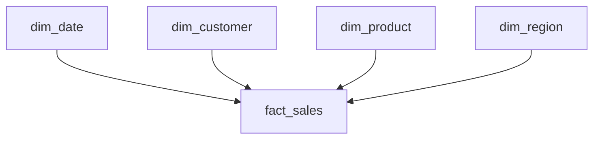

# Data Warehouse, Data Lake a Lakehouse Cheatsheet

Praktický přehled analytických úložišť, dimenzionálního modelování a návaznosti na Power BI.

---

# 1. Provozní a analytické prostředí

## OLTP

**OLTP — Online Transaction Processing** podporuje každodenní provoz aplikace nebo firmy.

Typické operace:

- vytvoření objednávky;
- přijetí platby;
- změna skladové zásoby;
- aktualizace zákazníka;
- změna stavu objednávky.

```text
zákazník vytvoří objednávku
→ zápis objednávky
→ úprava skladu
→ uložení platby
```

Provozní databáze je optimalizovaná především pro rychlé zápisy a změny jednotlivých záznamů.

## OLAP

**OLAP — Online Analytical Processing** slouží k analýze většího množství historických dat.

Typické otázky:

- Jak se vyvíjely měsíční tržby?
- Který region je nejziskovější?
- Jaké jsou výsledky produktových kategorií?
- Jak se liší zákazníci B2B a B2C?

```text
historická data
→ filtrování a agregace
→ analýza
→ reporting
```

| Oblast | OLTP | OLAP |
|---|---|---|
| Hlavní účel | Každodenní provoz | Analýza a reporting |
| Typická operace | Vložení nebo změna záznamu | Agregace mnoha záznamů |
| Časový pohled | Především aktuální stav | Historický vývoj |
| Typický uživatel | Aplikace a provozní tým | Analytik, BI tým a management |

---

# 2. Data warehouse

**Data warehouse**, česky datový sklad, je analytické úložiště připravené pro dotazování, reporting a rozhodování.

Může integrovat data z více systémů:

```text
e-shop
CRM
sklad
účetnictví
marketing
    ↓
data warehouse
    ↓
SQL / Power BI
```

Data v něm bývají:

- propojená z více zdrojů;
- vyčištěná a validovaná;
- historická;
- strukturovaná pro analytiku;
- založená na jednotných business pravidlech.

Datový sklad pomáhá zajistit, aby různé reporty používaly stejné definice tržeb, nákladů, zisku nebo počtu objednávek.

---

# 3. Faktová tabulka

**Faktová tabulka** zachycuje měřitelné obchodní události nebo procesy.

V prodejním modelu může jeden řádek představovat:

```text
1 položku 1 objednávky
```

Typický obsah `fact_sales`:

## Technický klíč

- `sales_key` – jednoznačný technický identifikátor řádku.

## Identifikace objednávky

- `order_id` – identifikátor celé objednávky;
- `line_number` – pořadí položky uvnitř objednávky.

## Cizí klíče

- `date_key`;
- `customer_key`;
- `product_key`;
- `region_key`.

## Transakční hodnoty

- `quantity`;
- `unit_price`;
- `unit_cost`;
- `discount_pct`;
- `revenue`;
- `cost`.

---

# 4. Granularita

**Granularita** určuje, co přesně představuje jeden řádek faktové tabulky.

Příklad:

```text
1 řádek
=
1 položka jedné objednávky
```

Pokud objednávka obsahuje čtyři produktové položky, vzniknou ve faktové tabulce čtyři řádky.

Granularitu stanovujeme před návrhem sloupců a výpočtů. Ovlivňuje například:

- počet řádků;
- způsob výpočtu počtu objednávek;
- dostupnou úroveň detailu;
- význam uložených hodnot;
- kontroly duplicit.

Při granularitě položky objednávky platí:

```text
COUNTROWS(fact_sales)
→ počet položek

DISTINCTCOUNT(fact_sales[order_id])
→ počet objednávek
```

---

# 5. Dimenzní tabulky

**Dimenzní tabulky** obsahují popisné informace, podle kterých fakta filtrujeme, seskupujeme a zobrazujeme.

```text
fakta
→ co a kolik se stalo

dimenze
→ kdo, co, kde a kdy
```

## `dim_customer`

- `customer_key`;
- `customer_id`;
- `customer_name`;
- `customer_type`.

## `dim_product`

- `product_key`;
- `product_id`;
- `product_name`;
- `category`;
- `brand`.

## `dim_date`

- `date_key`;
- `date`;
- `day`;
- `day_name`;
- `month_number`;
- `month_name`;
- `quarter`;
- `year`.

## `dim_region`

- `region_key`;
- `region_code`;
- `region_name`;
- `country`.

U každé dimenze musí být jasně definovaný business význam. Například region může představovat region doručení, sídlo zákazníka nebo region obchodní pobočky.

---

# 6. Druhy klíčů

## Natural key

**Natural key** neboli business key pochází ze zdrojového systému a má obchodní význam.

Příklady:

- `customer_id`;
- `product_id`;
- číslo smlouvy.

## Surrogate key

**Surrogate key** je technický klíč vytvořený v datovém skladu.

Příklady:

- `customer_key`;
- `product_key`;
- `region_key`.

```text
zdrojový customer_id
→ vyhledání v dim_customer
→ customer_key
→ uložení do fact_sales
```

## Degenerate dimension

**Degenerate dimension** je identifikátor s analytickým významem uložený přímo ve faktové tabulce, pro který není potřeba samostatná dimenze.

Příklad:

```text
fact_sales.order_id
```

Číslo objednávky umožňuje filtrovat a počítat objednávky, ale nemusí mít vlastní `dim_order`.

---

# 7. Unknown Member

Pokud faktový řádek odkazuje na neznámého zákazníka, produkt nebo region, neměl by být automaticky odstraněn.

V dimenzi lze vytvořit technický záznam:

```text
customer_key = 0
customer_name = Unknown
customer_type = Unknown
```

Nenalezenému zákazníkovi se ve `fact_sales` přiřadí:

```text
customer_key = 0
```

Výhody:

- prodej zůstane zachovaný;
- celkové výsledky nejsou podhodnocené;
- cizí klíč odkazuje na existující člen dimenze;
- problém s kvalitou dat lze sledovat v reportu.

---

# 8. Hvězdicové schéma

**Star schema**, česky hvězdicové schéma, má uprostřed faktovou tabulku a kolem ní dimenze.



Typické vztahy:

```text
dim_customer 1:N fact_sales
dim_product  1:N fact_sales
dim_date     1:N fact_sales
dim_region   1:N fact_sales
```

Na straně dimenze musí být klíč jedinečný. Ve faktové tabulce se může stejný cizí klíč opakovat.

V Power BI obvykle použijeme:

- kardinalitu `One to many (1:*)`;
- směr filtrování `Single`;
- filtrování z dimenze do faktové tabulky;
- aktivní vztah.

Dimenze v jednoduchém hvězdicovém schématu přímo mezi sebou nepropojujeme.

---

# 9. Snowflake schema

**Snowflake schema**, česky vločkové schéma, rozděluje dimenze do dalších navazujících tabulek.

```text
fact_sales
→ dim_product
→ dim_category
→ dim_department
```

Ve hvězdicovém schématu mohou být tyto atributy v jedné dimenzi:

```text
dim_product
├── product_name
├── category
└── department
```

Hvězdicové schéma bývá pro Power BI jednodušší a přehlednější. Snowflake omezuje opakování některých hodnot, ale přidává další tabulky a vztahy.

---

# 10. Vazební tabulka

**Bridge table**, česky vazební tabulka, se používá především k řešení vztahu M:N.

Příklad: jeden produkt může být v několika kampaních a jedna kampaň může obsahovat více produktů.

```text
dim_product 1:N bridge_product_campaign
dim_campaign 1:N bridge_product_campaign
```

Vazební tabulka obvykle obsahuje hlavně klíče propojených záznamů. Na rozdíl od běžné faktové tabulky nemusí obsahovat měřitelné obchodní hodnoty.

---

# 11. Datamart

**Datamart** je analytická část zaměřená na konkrétní oblast firmy nebo konkrétní skupinu uživatelů.

Příklady:

```text
data warehouse
├── Sales datamart
├── Finance datamart
├── Marketing datamart
└── Logistics datamart
```

Sales datamart může obsahovat:

- `fact_sales`;
- `dim_customer`;
- `dim_product`;
- `dim_date`;
- `dim_region`.

Datamart nemusí být samostatná fyzická databáze. Může jít o databázové schéma, sadu tabulek nebo pohledů či logicky oddělenou část datového skladu.

---

# 12. Data lake

**Data lake**, česky datové jezero, ukládá různé typy dat často v původní nebo méně zpracované podobě.

Může obsahovat:

- CSV;
- JSON;
- Parquet;
- databázové exporty;
- aplikační logy;
- dokumenty;
- obrázky, zvuk nebo video.

```text
data lake
├── csv/
├── json/
├── parquet/
├── logs/
└── images/
```

Data lake umožňuje:

- zachovat původní zdrojová data;
- zopakovat jejich zpracování;
- ukládat různé datové formáty;
- připravovat data pro více budoucích účelů.

Samotné uložení souborů ale nezajišťuje jejich kvalitu, význam ani připravenost pro reporting.

## Data swamp

Pokud data lake nemá názvová pravidla, metadata, kontrolu kvality, správu přístupů a vlastníky dat, může se změnit na nepřehledný **data swamp**.

---

# 13. Schema-on-write a schema-on-read

## Schema-on-write

Struktura se uplatní před nebo při zápisu dat do cílového analytického modelu.

```text
zdrojová data
→ kontrola a transformace
→ stanovená struktura
→ data warehouse
```

Tento přístup je typický pro data warehouse.

## Schema-on-read

Data se nejprve uloží a jejich struktura se aplikuje až při konkrétním načtení.

```text
zdrojová data
→ data lake
→ pozdější načtení a interpretace
```

Tento přístup je častý u data lake. Jde o typické charakteristiky, nikoliv absolutní pravidla.

---

# 14. Lakehouse

**Lakehouse** kombinuje flexibilní ukládání data lake s některými vlastnostmi řízeného data warehouse.

```text
flexibilní souborové úložiště
+
řízené analytické tabulky
=
lakehouse
```

Lakehouse může podporovat:

- původní i připravená data;
- různé formáty dat;
- řízené tabulky nad soubory;
- kontrolu schématu;
- historii změn;
- SQL analytiku;
- BI reporting;
- data engineering a machine learning.

Data mohou být fyzicky uložená například jako Parquet. Tabulkový formát nad soubory eviduje jejich strukturu, změny a aktuální verzi tabulky.

```text
Parquet
→ fyzické uložení dat

tabulkový formát
→ řízení souborů jako tabulky

lakehouse
→ analytické prostředí nad těmito daty
```

---

# 15. Warehouse, lake a lakehouse

| Oblast | Data warehouse | Data lake | Lakehouse |
|---|---|---|---|
| Typická data | Připravená a strukturovaná | Různé formáty, často původní data | Různé formáty a řízené tabulky |
| Hlavní účel | BI, reporting a analytika | Uložení a další zpracování | Analytika, BI, engineering a ML |
| Organizace | Předem navržené tabulky | Volnější souborová struktura | Soubory řízené jako tabulky |
| Schéma | Typicky při zápisu | Často při čtení | Podle datové vrstvy |
| Typický uživatel | Analytik a BI tým | Data engineer a data scientist | Více datových rolí |

Hranice se v moderních platformách mohou překrývat. Konkrétní firma může používat:

- pouze data warehouse;
- data lake společně s data warehouse;
- lakehouse;
- kombinaci více přístupů.

---

# 16. Příklad architektury lake + warehouse

```text
CSV, JSON a databázové exporty
                ↓
            data lake
       původní zdrojová data
                ↓
      čištění a transformace
                ↓
          data warehouse
           Sales datamart
                ↓
             Power BI
```

Role jednotlivých částí:

```text
data lake
→ uchování původních dat

data warehouse
→ důvěryhodná a strukturovaná analytická data

Power BI
→ sémantický model, DAX a vizualizace
```

---

# 17. Source-to-target mapping

**Source-to-target mapping** určuje, ze kterého zdrojového údaje vznikne cílová tabulka a sloupec.

Příklad:

```text
customers.json
→ dim_customer

products
→ dim_product

kalendář
→ dim_date

regiony doručení
→ dim_region

orders.csv
→ fact_sales
```

Při načítání faktové tabulky se zdrojové business klíče vyhledají v dimenzích a nahradí odpovídajícími technickými klíči.

```text
customer_id = 108
→ lookup v dim_customer
→ customer_key = 7
→ fact_sales.customer_key = 7
```

---

# 18. Řádkové výpočty a DAX

Stabilní řádkové hodnoty lze připravit v data warehouse:

```text
revenue
= quantity × unit_price × (1 − discount_pct)

cost
= quantity × unit_cost
```

Power BI z nich vytvoří agregované míry respektující aktuální filtry:

```DAX
Total Revenue =
SUM(fact_sales[revenue])
```

```DAX
Total Cost =
SUM(fact_sales[cost])
```

```DAX
Total Profit =
[Total Revenue] - [Total Cost]
```

```DAX
Order Count =
DISTINCTCOUNT(fact_sales[order_id])
```

```DAX
Average Order Value =
DIVIDE(
    [Total Revenue],
    [Order Count]
)
```

```DAX
Profit Margin % =
DIVIDE(
    [Total Profit],
    [Total Revenue]
)
```

---

# 19. Validace datového modelu

Před předáním dat do Power BI ověříme:

## Jedinečnost klíčů

- každý technický klíč je v příslušné dimenzi jedinečný;
- kombinace `order_id + line_number` není ve `fact_sales` duplicitní.

## Referenční integritu

- každý cizí klíč ve `fact_sales` odkazuje na existující člen dimenze;
- nenalezené hodnoty jsou přiřazeny záznamu `Unknown`.

## Validitu hodnot

```text
quantity > 0
unit_price >= 0
unit_cost >= 0
0 <= discount_pct <= 1
```

Vratky, storna a opravné transakce musí mít vlastní business pravidla.

## Správnost výpočtů

- přepočet `revenue`;
- přepočet `cost`;
- kontrola použití slevy.

## Reconciliation

**Reconciliation** znamená odsouhlasení cílových dat proti zdroji.

Porovnáváme například:

- počet objednávek;
- počet položek;
- celkové množství;
- celkové tržby;
- celkové náklady.

Každý rozdíl musí mít dohledatelný důvod.

---

# 20. Rozdělení rolí nástrojů

```text
zdrojové systémy
→ vytvářejí provozní data

data lake
→ uchovává původní a různorodá data

data warehouse
→ připravuje strukturovaná analytická data

Power BI
→ vytváří sémantický model, DAX a report
```

U menšího řešení lze faktové a dimenzní tabulky vytvořit až v Power Query. V centrálním firemním řešení se často připravují již v data warehouse, aby je mohlo opakovaně používat více reportů a týmů.

---

# 21. Praktické rozhodovací otázky

Před návrhem analytického úložiště se ptáme:

1. Kde vznikají zdrojová data?
2. Potřebujeme zachovat jejich původní podobu?
3. Jaké formáty musíme ukládat?
4. Co představuje jeden řádek faktové tabulky?
5. Které hodnoty jsou fakta a které atributy dimenzí?
6. Jaké business klíče poskytují zdrojové systémy?
7. Potřebujeme technické klíče datového skladu?
8. Jak budeme řešit nenalezené členy dimenzí?
9. Která business pravidla mají být centrální?
10. Jak ověříme shodu cílových dat se zdrojem?
11. Bude model používat jeden report, nebo více týmů?
12. Je vhodnější warehouse, lake společně s warehouse, nebo lakehouse?

---

# 22. Co si pamatovat

```text
OLTP
→ každodenní provoz a transakce

OLAP
→ analytika a historická data

data warehouse
→ připravená a řízená analytická data

data lake
→ flexibilní uložení různých typů dat

lakehouse
→ flexibilní úložiště a řízené analytické tabulky

fact table
→ měřitelné obchodní události

dimension table
→ popisné údaje pro filtrování a seskupování

granularita
→ význam jednoho řádku faktové tabulky

star schema
→ faktová tabulka obklopená dimenzemi

datamart
→ analytická část zaměřená na konkrétní oblast

surrogate key
→ technický klíč datového skladu

natural key
→ klíč ze zdrojového systému

Unknown Member
→ technický člen pro nedohledanou hodnotu

reconciliation
→ odsouhlasení cílových dat proti zdroji
```

Hlavní princip:

> Původní data uchováváme pro dohledatelnost, analytická data připravujeme v jednotném modelu a Power BI používáme pro výpočty podle filtrů a prezentaci výsledků.